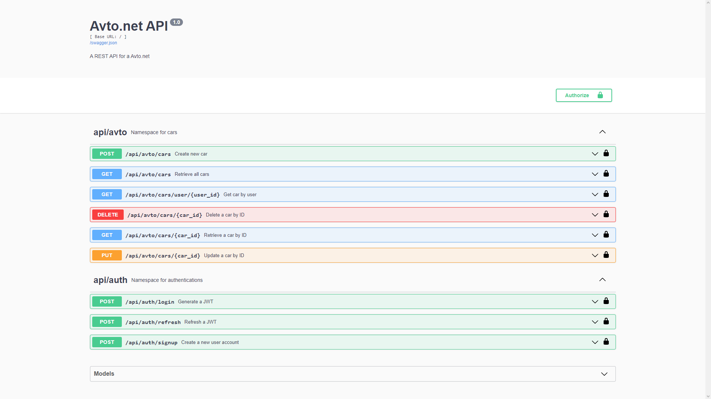

# Project name
Avto.net

# General info
API for cars management



# Routes to implement
| METHOD   | ROUTE                               | FUNCTIONALITY          |
|----------|-------------------------------------|------------------------|
| *POST*   | ```/api/auth/signup```              | register new user      |
| *POST*   | ```/api/auth/login```               | login user             |
| *GET*    | ```/api/avto/cars```                | details of all cars    |
| *POST*   | ```/api/avto/cars```                | create a car           |
| *GET*    | ```/api/avto/cars/{car_id}```       | details of car         |
| *PUT*    | ```/api/avto/cars/{car_id}```       | update a car           |
| *DELETE* | ```/api/avto/cars/{car_id}```       | delete a car           |
| *GET*    | ```/api/avto/cars/user/{user_id}``` | get users car          |
| *GET*    | ```/api/docs/```                    | view API documentation |


# Technologies
* python 3
* flask
* MySQL
* flask_restx
* flask_sqlalchemy
* flask_jwt_extended

# Setup

Clone the project Repository
```
git clone https://github.com/SergiiPachkovskyi/Avto_net

```

Enter the project folder and create a virtual environment
``` 
$ cd https://github.com/SergiiPachkovskyi/Avto_net 

$ python -m venv venv 

```

Activate the virtual environment
``` 
$ source env/bin/activate #On linux Or Unix

$ source env/Scripts/activate #On Windows  
```

Install all requirements

```
$ pip install -r requirements.txt
```

Run the project in development 
``` 
python app.py

or

flask run 
```

# Status
Project is: in progress
